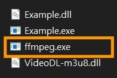
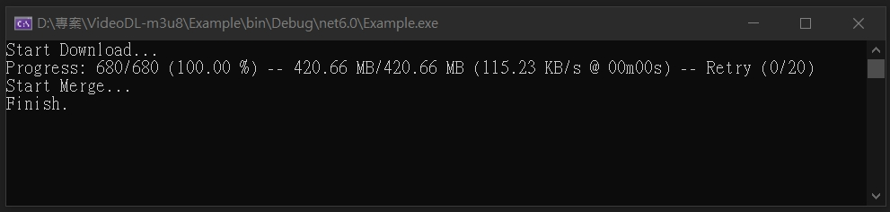

# VideoDL-m3u8  

This is m3u8/mpd/http video downloader which can download ts files and merge to mp4 video using FFmpeg.  

* Support m3u8 manifest parsing  
* Support ts or fmp4 file download  
* Support AES-128 decryption  
* Support m3u8 byte range  
* Support custom http header  
* Support multi-thread download  
* Support download speed limit  
* Support resuming from breakpoint  
* Support FFmpeg merge to mp4 video  
* Support png header detection  
* Support http or socks5 proxy  
* Support live stream record  
* Support output format conversion  
* Support m3u8 EXT-X-MEDIA  
* Support muxing video and audio  
* Support mpd manifest parsing  

---  

### Nuget install  

```
PM> Install-Package VideoDL-m3u8
```

---  

### FFmpeg  

Download and unzip to your project directory.  

[https://github.com/BtbN/FFmpeg-Builds/releases](https://github.com/BtbN/FFmpeg-Builds/releases)  

* ffmpeg-master-latest-win64-gpl.zip  

  

---  

### Demo  

  

---  

### Example  

```C#
// m3u8 url
var url = "";
// http request header
var header = "";
// video save directory
var workDir = @"D:\Temp";
// video save name
var saveName = "Video";

var videoDL = new VideoDL();

// Download m3u8/mpd/http video
await videoDL.DownloadAsync(
    workDir, saveName, url, header, clearTempFile: true);

// Download m3u8 video
await videoDL.HlsDownloadAsync(
    workDir, saveName, url, header, clearTempFile: true);

// Download mpd video
await videoDL.DashDownloadAsync(
    workDir, saveName, url, header, clearTempFile: true);

// Download http video
await videoDL.HttpDownloadAsync(
    workDir, saveName, url, header);
```

---  

### Proxy example  

```C#
var videoDL = new VideoDL(
    proxy: "http://127.0.0.1:8000");
// or
var videoDL = new VideoDL(
    proxy: "socks5://127.0.0.1:8000");
```

---  

> **Note**  
> More detailed operations.  

### Hls example  

```C#
// m3u8 url
var url = "";
// http request header
var header = "";
// video save directory
var workDir = @"D:\Temp";
// video save name
var saveName = "Video";
saveName = saveName.FilterFileName();

Console.WriteLine("Start Download...");

var videoDL = new VideoDL();
var hlsDL = videoDL.Hls;

// Download m3u8 manifest by url
var (manifest, m3u8Url) = await hlsDL.GetManifestAsync(url, header);

// Check master
if (manifest.IsMaster())
{
    // Parse m3u8 manifest to master playlist
    var masterPlaylist = hlsDL.ParseMasterPlaylist(manifest, m3u8Url);

    // Choose the highest quality resolution
    var highestStreamInfo = masterPlaylist.StreamInfos
        .GetWithHighestQuality();
    if (highestStreamInfo == null)
        throw new Exception("Not found stream info.");
    (manifest, m3u8Url) = await hlsDL.GetManifestAsync(
        highestStreamInfo.Uri, header);
}

// Parse m3u8 manifest to media playlist
var mediaPlaylist = hlsDL.ParseMediaPlaylist(manifest, m3u8Url);

// Download m3u8 segment key
var keys = null as Dictionary<string, string>;
var segmentKeys = hlsDL.GetKeys(mediaPlaylist.Parts);
if (segmentKeys.Count > 0)
    keys = await hlsDL.GetKeysDataAsync(segmentKeys, header);

// Download first segment
var firstSegment = await hlsDL.GetFirstSegmentAsync(
    workDir, saveName, mediaPlaylist.Parts, header, keys,
    onSegment: async (ms, token) =>
    {
        // Detect and skip png header
        return await ms.TrySkipPngHeaderAsync(token);
    });

Console.WriteLine("Loading Video Info...");

// Get video info
var videoInfos = await FFmpeg.GetVideoInfo(firstSegment);
videoInfos.ForEach(it => Console.WriteLine(it));

Console.WriteLine("Waiting...");

// Download m3u8 ts files
await hlsDL.DownloadAsync(workDir, saveName,
    mediaPlaylist.Parts, header, keys,
    threads: 4, maxSpeed: 5 * 1024 * 1024,
    onSegment: async (ms, token) =>
    {
        // Detect and skip png header
        return await ms.TrySkipPngHeaderAsync(token);
    },
    progress: (args) =>
    {
        var print = args.Format;
        var sub = Console.WindowWidth - 2 - print.Length;
        Console.Write("\r" + print + new string(' ', sub) + "\r");
    });

Console.WriteLine("\nStart Merge...");

// Merge m3u8 ts files by FFmpeg
await hlsDL.MergeAsync(workDir, saveName, 
    clearTempFile: true,
    onMessage: (msg) =>
    {
        Console.ForegroundColor = ConsoleColor.DarkYellow;
        Console.Write(msg);
        Console.ResetColor();
    });
Console.WriteLine("Finish.");
Console.ReadLine();
```

---  

### REC example  

```C#
// m3u8 url
var url = "";
// http request header
var header = "";
// video save directory
var workDir = @"D:\Temp";
// video save name
var saveName = "Live";
saveName = saveName.FilterFileName();

Console.WriteLine("Start REC...");

var videoDL = new VideoDL();
var hlsDL = videoDL.Hls;

// Download m3u8 manifest to media playlist
var mediaPlaylist = await hlsDL.GetMediaPlaylistAsync(url, header);

// Is a live stream
if (mediaPlaylist.IsLive())
{
    try
    {
        await hlsDL.REC(
            workDir, saveName, url, header,
            noSegStopTime: 60 * 1000,
            progress: (args) =>
            {
                var print = args.Format;
                var sub = Console.WindowWidth - 2 - print.Length;
                Console.Write("\r" + print + new string(' ', sub) + "\r");
            });
    }
    catch { }

    Console.WriteLine("\nStart Merge...");

    // Merge m3u8 ts files by FFmpeg
    await hlsDL.MergeAsync(workDir, saveName,
        discardcorrupt: true, genpts: true,
        igndts: true, ignidx: true,
        clearTempFile: true,
        onMessage: (msg) =>
        {
            Console.ForegroundColor = ConsoleColor.DarkYellow;
            Console.Write(msg);
            Console.ResetColor();
        });
    Console.WriteLine("Finish.");
    Console.ReadLine();
}
```

---  

### Muxing example  

```C#
// m3u8 url
var url = "";
// http request header
var header = "";
// video save directory
var workDir = @"D:\Temp";
// video save name
var saveName = "Video";
saveName = saveName.FilterFileName();
var videoSaveName = $"{saveName}(Video)";
var audioSaveName = $"{saveName}(Audio)";

Console.WriteLine("Start Download...");

var videoDL = new VideoDL();
var hlsDL = videoDL.Hls;

// Download master manifest by url
var masterPlaylist = await hlsDL.GetMasterPlaylistAsync(url, header);

// Download video m3u8 manifest by url
var highestStreamInfo = masterPlaylist.StreamInfos
    .GetWithHighestQuality();
if (highestStreamInfo == null)
    throw new Exception("Not found stream info.");
var videoPlaylist = await hlsDL.GetMediaPlaylistAsync(
    highestStreamInfo.Uri, header);

// Download audio m3u8 manifest by url
var audioMediaGroup = masterPlaylist.MediaGroups
    .Where(it => it.GroupId == highestStreamInfo.Audio)
    .FirstOrDefault();
if (audioMediaGroup == null)
    throw new Exception("Not found audio media.");
var audioPlaylist = await hlsDL.GetMediaPlaylistAsync(
    audioMediaGroup.Uri, header);

// Download and merge video and audio
var videoPath = await downloadMerge("Video", videoSaveName, videoPlaylist);
var audioPath = await downloadMerge("Audio", audioSaveName, audioPlaylist);

// Muxing video source and audio source
await hlsDL.MuxingAsync(
    workDir, saveName, videoPath, audioPath,
    outputFormat: MuxOutputFormat.MP4,
    clearSource: false,
    onMessage: (msg) =>
    {
        Console.ForegroundColor = ConsoleColor.DarkYellow;
        Console.Write(msg);
        Console.ResetColor();
    });
Console.WriteLine("Finish.");
Console.ReadLine();

async Task<string> downloadMerge(string id, string saveName, MediaPlaylist mediaPlaylist)
{
    Console.WriteLine($"Start {id} Download...");

    // Download m3u8 segment key
    var keys = null as Dictionary<string, string>;
    var segmentKeys = hlsDL.GetKeys(mediaPlaylist.Parts);
    if (segmentKeys.Count > 0)
        keys = await hlsDL.GetKeysDataAsync(segmentKeys, header);

    // Download first segment
    var firstSegment = await hlsDL.GetFirstSegmentAsync(
        workDir, saveName, mediaPlaylist.Parts, header, keys);

    Console.WriteLine($"Loading {id} Info...");

    // Get video info
    var videoInfos = await FFmpeg.GetVideoInfo(firstSegment);
    videoInfos.ForEach(it => Console.WriteLine(it));

    Console.WriteLine("Waiting...");

    // Download m3u8 ts files
    await hlsDL.DownloadAsync(workDir, saveName,
        mediaPlaylist.Parts, header, keys,
        threads: 4, maxSpeed: 5 * 1024 * 1024,
        progress: (args) =>
        {
            var print = args.Format;
            var sub = Console.WindowWidth - 2 - print.Length;
            Console.Write("\r" + print + new string(' ', sub) + "\r");
        });

    Console.WriteLine($"\nStart {id} Merge...");

    // Merge m3u8 ts files by FFmpeg
    var outputPath = await hlsDL.MergeAsync(workDir, saveName,
        clearTempFile: true, binaryMerge: true,
        outputFormat: OutputFormat.TS,
        onMessage: (msg) =>
        {
            Console.ForegroundColor = ConsoleColor.DarkYellow;
            Console.Write(msg);
            Console.ResetColor();
        });
    return outputPath;
}
```

---  

### MPD example  

```C#
// mpd url
var url = "";
// http request header
var header = "";
// video save directory
var workDir = @"D:\Temp";
// video save name
var saveName = "Video";
saveName = saveName.FilterFileName();
var videoSaveName = $"{saveName}(Video)";
var audioSaveName = $"{saveName}(Audio)";

Console.WriteLine("Start Download...");

var videoDL = new VideoDL();
var dashDL = videoDL.Dash;
var hlsDL = videoDL.Hls;

// Download mpd manifest by url
var (manifest, mpdUrl) = await dashDL.GetManifestAsync(url, header);

// Parse manifest to mpd
var mpd = dashDL.ParseMpd(manifest, mpdUrl);

// Select mpd first period
var period = mpd.Periods.First();
var video = period.GetWithHighestQualityVideo();
var audio = period.GetWithHighestQualityAudio();

if (video == null || audio == null)
    throw new Exception("Not found video or audio.");

// Expand segmentBase to segmentList
await dashDL.ExpandSegmentBase(video, header);
await dashDL.ExpandSegmentBase(audio, header);

// Parse mpd to m3u8 media playlist
var videoPlaylist = dashDL.ToMediaPlaylist(video);
var audioPlaylist = dashDL.ToMediaPlaylist(audio);

// Download and merge video and audio
var videoPath = await downloadMerge("Video", videoSaveName, videoPlaylist);
var audioPath = await downloadMerge("Audio", audioSaveName, audioPlaylist);

// Muxing video source and audio source
await hlsDL.MuxingAsync(
    workDir, saveName, videoPath, audioPath,
    outputFormat: MuxOutputFormat.MP4,
    clearSource: false,
    onMessage: (msg) =>
    {
        Console.ForegroundColor = ConsoleColor.DarkYellow;
        Console.Write(msg);
        Console.ResetColor();
    });
    Console.WriteLine("Finish.");
    Console.ReadLine();

async Task<string> downloadMerge(string id, string saveName, MediaPlaylist mediaPlaylist)
{
    Console.WriteLine($"Start {id} Download...");

    // Download m3u8 segment key
    var keys = null as Dictionary<string, string>;
    var segmentKeys = hlsDL.GetKeys(mediaPlaylist.Parts);
    if (segmentKeys.Count > 0)
        keys = await hlsDL.GetKeysDataAsync(segmentKeys, header);

    // Download first segment
    var firstSegment = await hlsDL.GetFirstSegmentAsync(
        workDir, saveName, mediaPlaylist.Parts, header, keys);

    Console.WriteLine($"Loading {id} Info...");

    // Get video info
    var videoInfos = await FFmpeg.GetVideoInfo(firstSegment);
    videoInfos.ForEach(it => Console.WriteLine(it));

    Console.WriteLine("Waiting...");

    // Download m3u8 ts files
    await hlsDL.DownloadAsync(workDir, saveName,
        mediaPlaylist.Parts, header, keys,
        threads: 4, maxSpeed: 5 * 1024 * 1024,
        progress: (args) =>
        {
            var print = args.Format;
            var sub = Console.WindowWidth - 2 - print.Length;
            Console.Write("\r" + print + new string(' ', sub) + "\r");
        });

    Console.WriteLine($"\nStart {id} Merge...");

    // Merge mpd mp4 files by FFmpeg
    var outputPath = await hlsDL.MergeAsync(workDir, saveName,
        clearTempFile: true, binaryMerge: true,
        outputFormat: OutputFormat.MP4,
        onMessage: (msg) =>
        {
            Console.ForegroundColor = ConsoleColor.DarkYellow;
            Console.Write(msg);
            Console.ResetColor();
        });
    return outputPath;
}
```

---  

### Http example  

```C#
// video url
var url = "";
// http request header
var header = "";
// video save directory
var workDir = @"D:\Temp";
// video save name
var saveName = "Video";
saveName = saveName.FilterFileName();

Console.WriteLine("Start Download...");

var videoDL = new VideoDL();
var httpDL = videoDL.Http;

// Download video file
await httpDL.DownloadAsync(workDir, saveName, 
    url, header, threads: 4, maxSpeed: 5 * 1024 * 1024,
    progress: (args) =>
    {
        var print = args.Format;
        var sub = Console.WindowWidth - 2 - print.Length;
        Console.Write("\r" + print + new string(' ', sub) + "\r");
    });
Console.WriteLine("\nFinish.");
Console.ReadLine();
```

---  

### Documentation  

* **VideoDL.DownloadAsync**  

```C#
// Download m3u8/mpd/http video
public virtual async Task DownloadAsync(
    string workDir, 
    string saveName, 
    string url, 
    string header = "",
    int threads = 1, 
    int delay = 200, 
    int maxRetry = 20, 
    long? maxSpeed = null,
    int interval = 1000, 
    bool checkComplete = true, 
    int? videoMaxHeight = null,
    string? audioLanguage = null,
    int? noSegStopTime = null,
    CancellationToken stopRecToken = default,
    bool binaryMerge = false, 
    bool keepFragmented = false, 
    bool discardcorrupt = false,
    bool genpts = false, 
    bool igndts = false, 
    bool ignidx = false,
    OutputFormat outputFormat = OutputFormat.MP4,
    bool clearTempFile = false, 
    bool clearSource = false,
    Func<List<Part>, List<Part>>? partFilter = null,
    Func<List<Period>, List<Period>>? periodFilter = null,
    bool quiet = false,
    CancellationToken token = default)
```

* **workDir:** string, required  
　Set video download directory.  

* **saveName:** string, required  
　Set video save name.  

* **url:** string, required  
　Set m3u8/mpd/http url.  

* **header:** string, optional, default: ""  
　Set http request header.  
　format: key1:key1|key2:key2  

* **threads:** int, optional, default: 1  
　Set the number of threads to download.  

* **delay:** int, optional, default: 200  
　Set http request delay. (millisecond)  

* **maxRetry:** int, optional, default: 20  
　Set the maximum number of download retries.  

* **maxSpeed:** long, optional, default: null  
　Set the maximum download speed. (byte)  
　1KB = 1024 byte, 1MB = 1024 * 1024 byte  
        
* **interval:** int, optional, default: 1000  
　Set the progress callback time interval. (millisecond)  

* **checkComplete:** bool, optional, default: true  
　Set whether to check file count complete.  

* **videoMaxHeight:** int, optional, default: null  
　Set video maximum resolution height.  

* **audioLanguage:** string, optional, default: null  
　Set audio language.  

* **noSegStopTime:** int, optional, default: null  
　Set how long to stop after when there is no segment. (millisecond)  

* **stopRecToken:** CancellationToken, optional, default: default  
　Set stop REC cancellation token.  

* **binaryMerge:** bool, optional, default: false  
　Set use binary merge.  

* **keepFragmented:** bool, optional, default: false  
　Set keep fragmented mp4.  

* **discardcorrupt:** bool, optional, default: false  
　Set ffmpeg discard corrupted packets.  

* **genpts:** bool, optional, default: false  
　Set ffmpeg generate missing PTS if DTS is present.  

* **igndts:** bool, optional, default: false  
　Set ffmpeg ignore DTS if PTS is set.  

* **ignidx:** bool, optional, default: false  
　Set ffmpeg ignore index.  

* **outputFormat:** OutputFormat, optional, default: MP4  
　Set video output format.  

* **clearTempFile:** bool, optional, default: false  
　Set whether to clear the temporary file after the merge is completed.  

* **clearSource:** bool, optional, default: false  
　Set whether to clear source file after the muxing is completed.  

* **partFilter:** Func\<List\<Part\>, List\<Part\>\>, optional, default: null  
　Set m3u8 part filter.  

* **periodFilter:** Func\<List\<Period\>, List\<Period\>\>, optional, default: null  
　Set mpd period filter.  

* **quiet:** bool, optional, default: false  
　Set quiet mode.  

* **token:** CancellationToken, optional, default: default  
　Set cancellation token.  

---  

* **HlsDL.DownloadAsync**  

```C#
// Download m3u8 ts files
public async Task DownloadAsync(
    string workDir, 
    string saveName, 
    List<Part> parts,
    string header = "", 
    Dictionary<string, string>? keys = null,
    int threads = 1, 
    int delay = 200, 
    int maxRetry = 20,
    long? maxSpeed = null, 
    int interval = 1000,
    bool checkComplete = false,
    bool onlyFirstSegment = false,
    Func<Stream, CancellationToken, Task<Stream>>? onSegment = null,
    Action<ProgressEventArgs>? progress = null,
    CancellationToken token = default)
```

* **workDir:** string, required  
　Set video download directory.  

* **saveName:** string, required  
　Set video save name.  

* **parts:** List\<Part\>, required  
　Set m3u8 media playlist parts to download.  

* **header:** string, optional, default: ""  
　Set http request header.  
　format: key1:key1|key2:key2  
        
* **keys:** Dictionary\<string, string\>, optional, default: null  
　Set m3u8 segment keys.  

* **threads:** int, optional, default: 1  
　Set the number of threads to download.  

* **delay:** int, optional, default: 200  
　Set http request delay. (millisecond)  

* **maxRetry:** int, optional, default: 20  
　Set the maximum number of download retries.  

* **maxSpeed:** long, optional, default: null  
　Set the maximum download speed. (byte)  
　1KB = 1024 byte, 1MB = 1024 * 1024 byte  
        
* **interval:** int, optional, default: 1000  
　Set the progress callback time interval. (millisecond)  

* **checkComplete:** bool, optional, default: true  
　Set whether to check file count complete.  

* **onlyFirstSegment:** bool, optional, default: false  
　Set only download the first segment.  

* **onSegment:** Func<Stream, CancellationToken, Task\<Stream\>\>, optional, default: null  
　Set segment download callback.  

* **progress:** Action\<ProgressEventArgs\>, optional, default: null  
　Set progress callback.  

* **token:** CancellationToken, optional, default: default  
　Set cancellation token.  

---  

* **HlsDL.MergeAsync**  

```C#
// Merge m3u8 ts files
public async Task MergeAsync(
    string workDir,
    string saveName,
    OutputFormat outputFormat = OutputFormat.MP4, 
    bool binaryMerge = false,
    bool keepFragmented = false, 
    bool discardcorrupt = false,
    bool genpts = false, 
    bool igndts = false,  
    bool ignidx = false,
    bool clearTempFile = false, 
    Action<string>? onMessage = null,
    CancellationToken token = default)
```

* **workDir:** string, required  
　Set video download directory.  

* **saveName:** string, required  
　Set video save name.  

* **outputFormat:** OutputFormat, optional, default: MP4  
　Set video output format.  

* **binaryMerge:** bool, optional, default: false  
　Set use binary merge.  

* **keepFragmented:** bool, optional, default: false  
　Set keep fragmented mp4.  

* **discardcorrupt:** bool, optional, default: false  
　Set ffmpeg discard corrupted packets.  

* **genpts:** bool, optional, default: false  
　Set ffmpeg generate missing PTS if DTS is present.  

* **igndts:** bool, optional, default: false  
　Set ffmpeg ignore DTS if PTS is set.  

* **ignidx:** bool, optional, default: false  
　Set ffmpeg ignore index.  

* **clearTempFile:** bool, optional, default: false  
　Set whether to clear the temporary file after the merge is completed.  

* **onMessage:** Action\<string\>, optional, default: null  
　Set callback function for FFmpeg warning or error messages.  

* **token:** CancellationToken, optional, default: default  
　Set cancellation token.  

---  

* **HlsDL.REC**  

```C#
// REC m3u8 live stream
public async Task REC(
    string workDir, 
    string saveName,
    string url, 
    string header = "", 
    int maxRetry = 20, 
    long? maxSpeed = null, 
    int interval = 1000, 
    int? noSegStopTime = null,
    Func<Stream, CancellationToken, Task<Stream>>? onSegment = null,
    Action<RecProgressEventArgs>? progress = null,
    CancellationToken token = default)
```

* **workDir:** string, required  
　Set video download directory.  

* **saveName:** string, required  
　Set video save name.  

* **url:** string, required  
　Set m3u8 live stream url.  

* **header:** string, optional, default: ""  
　Set http request header.  
　format: key1:key1|key2:key2  

* **maxRetry:** int, optional, default: 20  
　Set the maximum number of download retries.  

* **maxSpeed:** long, optional, default: null  
　Set the maximum download speed. (byte)  
　1KB = 1024 byte, 1MB = 1024 * 1024 byte  

* **interval:** int, optional, default: 1000  
　Set the progress callback time interval. (millisecond)  

* **noSegStopTime:** int, optional, default: null  
　Set how long to stop after when there is no segment. (millisecond)  

* **onSegment:** Func<Stream, CancellationToken, Task\<Stream\>\>, optional, default: null  
　Set segment download callback.  

* **progress:** Action\<RecProgressEventArgs\>, optional, default: null  
　Set progress callback.  

* **token:** CancellationToken, optional, default: default  
　Set cancellation token.  

---  

* **HlsDL.MuxingAsync**  

```C#
// Muxing video source and audio source
public async Task MuxingAsync(
    string workDir, 
    string saveName,
    string videoSourcePath, 
    string audioSourcePath,
    MuxOutputFormat outputFormat = MuxOutputFormat.MP4,
    bool clearSource = false, 
    Action<string>? onMessage = null,
    CancellationToken token = default)
```

* **workDir:** string, required  
　Set video save directory.  

* **saveName:** string, required  
　Set video save name.  

* **videoSourcePath:** string, required  
　Set video source path.  

* **audioSourcePath:** string, required  
　Set audio source path.  

* **outputFormat:** MuxOutputFormat, optional, default: MP4  
　Set video output format.  

* **clearSource:** bool, optional, default: false  
　Set whether to clear source file after the muxing is completed.  

* **onMessage:** Action\<string\>, optional, default: null  
　Set callback function for FFmpeg warning or error messages.  

* **token:** CancellationToken, optional, default: default  
　Set cancellation token.  
